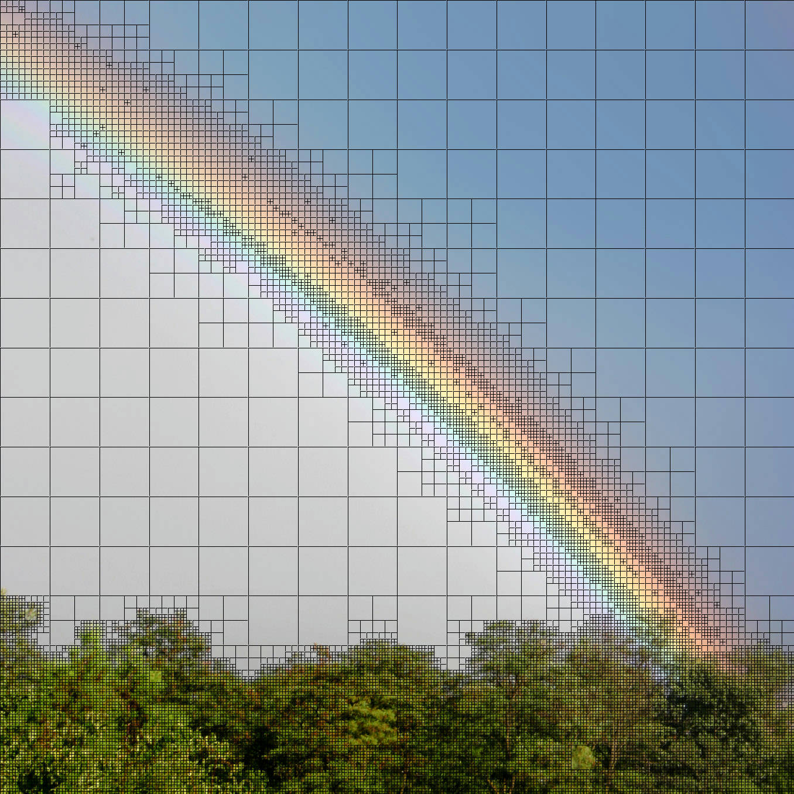
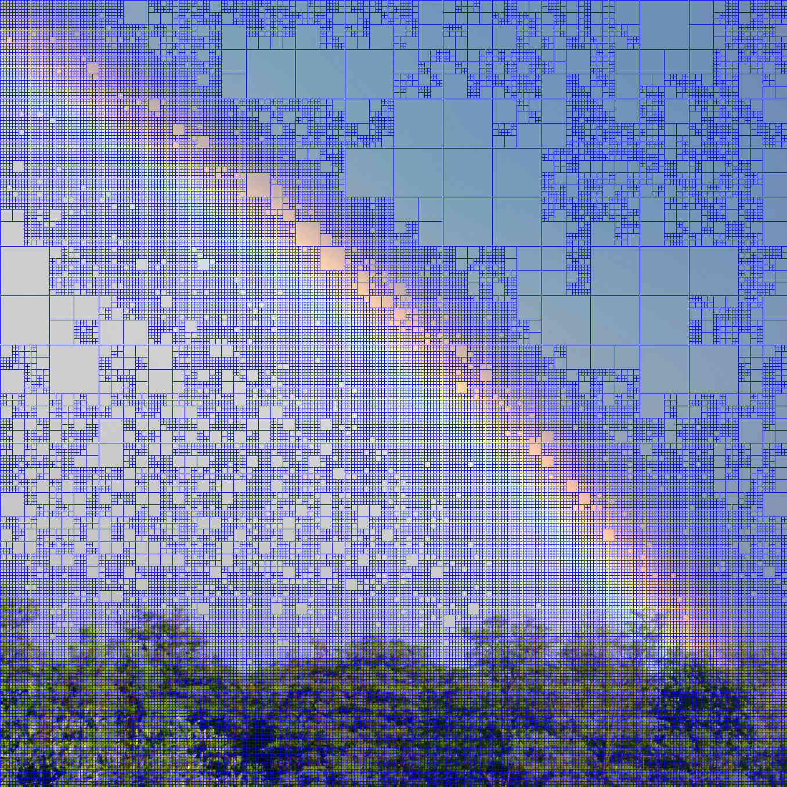

<h1>quadtree over media</h1>

 

<a href="https://github.com/JacopoWolf/quadtree-over-media-rs/wiki">Documentation 📗</a>
 
<code>quadtree-over-media --help</code>

---

This program calculates and draws "quads" on images in variuos input formats (for supported formats see the [image crate](https://crates.io/crates/image)).

[
demonstration video](https://youtu.be/G434WPz8MRk) 

Everything is completely customizable, from rgba tresholds to subdivide the quads to how to draw the quads.

## Installation
For the latest tag check the release page

`cargo install --git https://github.com/JacopoWolf/quadtree-over-media-rs.git --tag v1.0.0`

_NOTE: I don't suggest installing directly from the base branch (by not specifying a tag) because I'm lazy and develop directly in main_

## Examples

Below examples all add parameters to this base command:

`quadtree-over-media -i Rainbow_in_Budapest.jpg -o rainbow-something.jpg`

|                                                     |                                                |                                                         |
| :-------------------------------------------------: | :--------------------------------------------: | :-----------------------------------------------------: |
|                 __`--color black`__                 |       __`--color blue --treshold FF0`__        |                      __`--fill`__                       |
|     |  |           |
|              __`--fill-with dog.jpg`__              |        __`--fill --fill-with dog.jpg`__        | __`--fill --fill-with dog.jpg`   `--treshold 000`__ |
|  |    |        |

> CC image from Wikipedia https://commons.wikimedia.org/wiki/File:Rainbow_in_Budapest.jpg

### Inspired by
* https://github.com/snailcon/QuadtreeAmogufier
