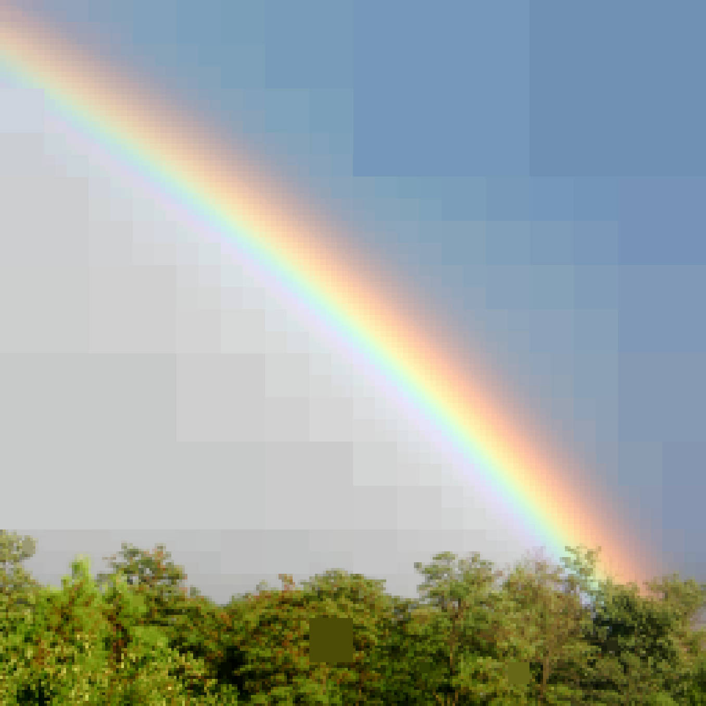
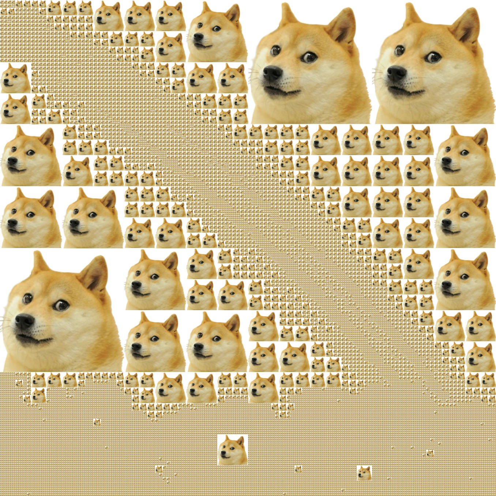
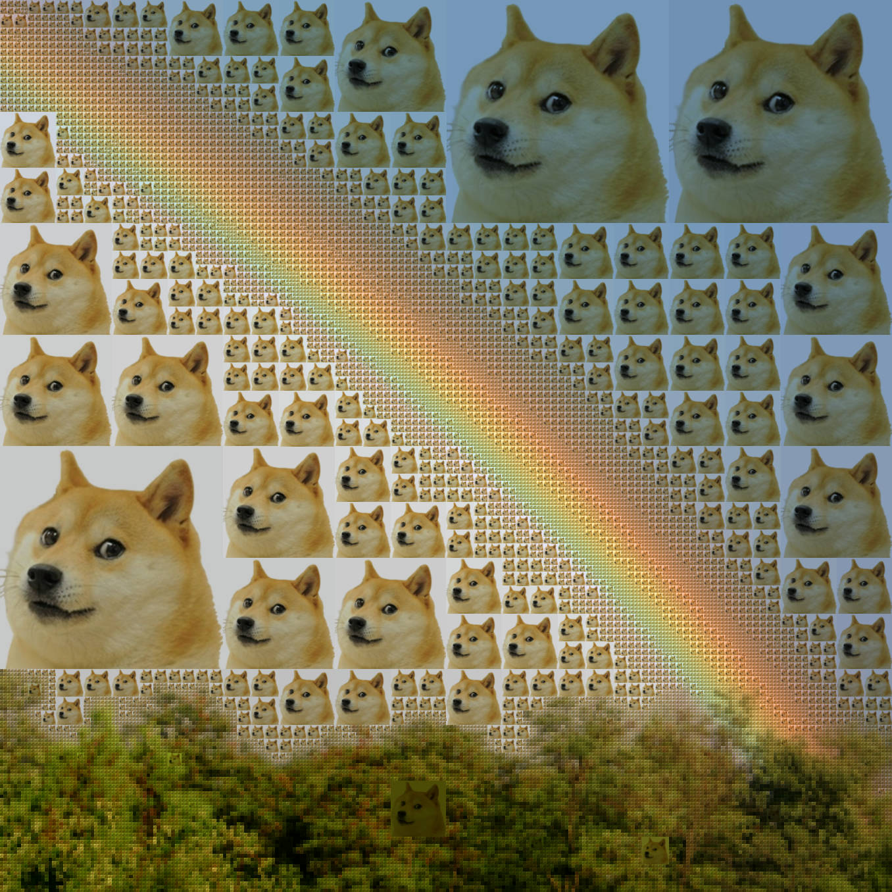
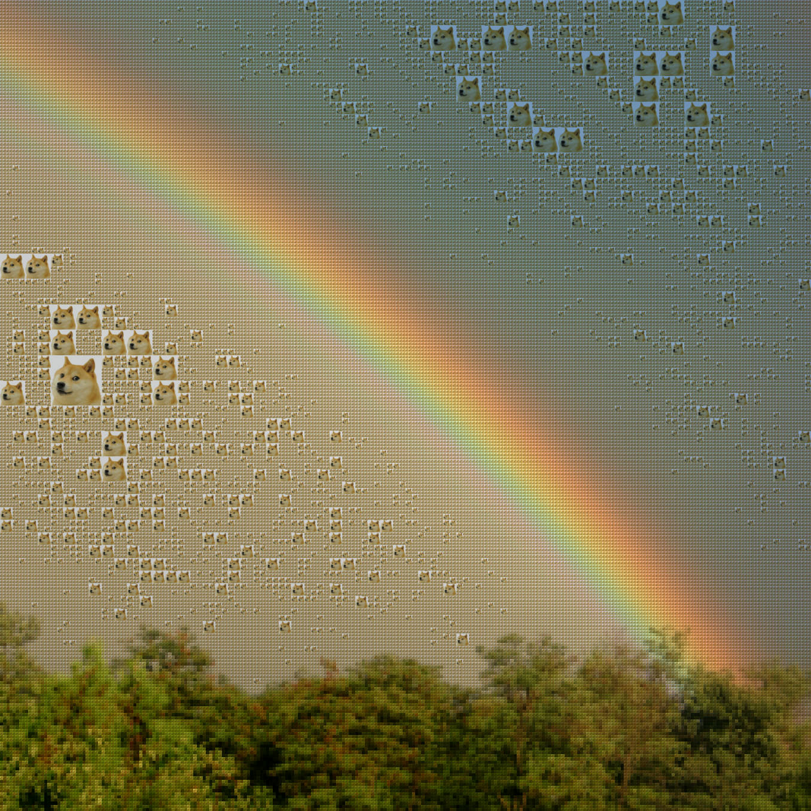

<h1>quadtree over media</h1>

 

<a href="https://github.com/JacopoWolf/quadtree-over-media-rs/wiki">Documentation 📗</a>
 
<code>quadtree-over-media --help</code>

---

This program calculates and draws "quads" on images in variuos input formats (for supported formats see the [image crate](https://crates.io/crates/image)).

[
demonstration video](https://youtu.be/G434WPz8MRk) 

Everything is completely customizable, from rgba tresholds to subdivide the quads to how to draw the quads.

### Examples

Examples use this CC image from wikipedia https://commons.wikimedia.org/wiki/File:Rainbow_in_Budapest.jpg

Below examples all add parameters to this base command:

`quadtree-over-media -i Rainbow_in_Budapest.jpg -o rainbow-something.jpg`

* <code>--fill</code> 

* <code>--fill-with dog-whitebg.jpg</code> 

* <code>--fill --fill-with dog-whitebg.jpg</code> 

* <code>--fill --fill-with dog-whitebg.jpg --treshold 000</code> 

### Inspired by
* https://github.com/snailcon/QuadtreeAmogufier
